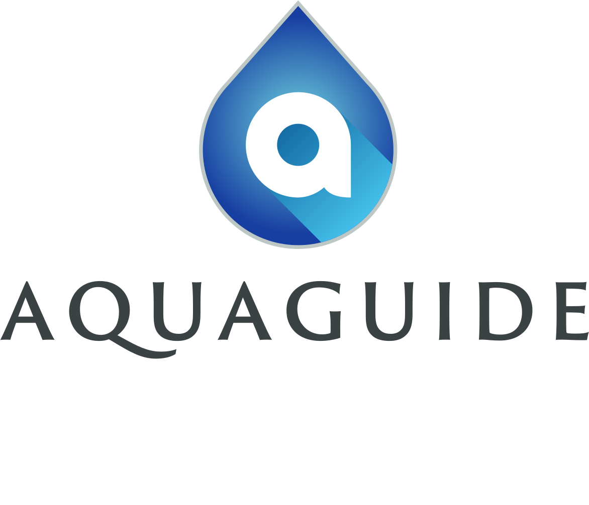

# SE_aquaguide

This is a data collection app. 

## Dependencies/Pre-requisites
* Flutter SDK, to install see: https://flutter.dev/docs/get-started/install
## Setup/Installation
1. Clone this repo
2. Go to directory
3. From the terminal: Run `flutter pub get`
## Usage
To build the project in debug mode, run:
`flutter run`
To build in release mode, run:
`flutter run --release`

## Known Issues
No bug reported yet.

